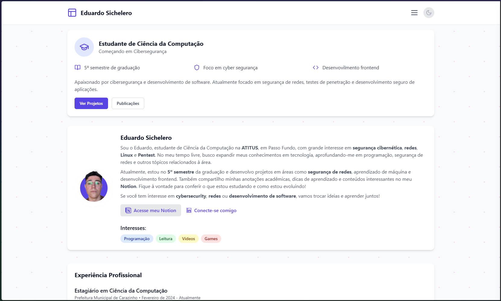
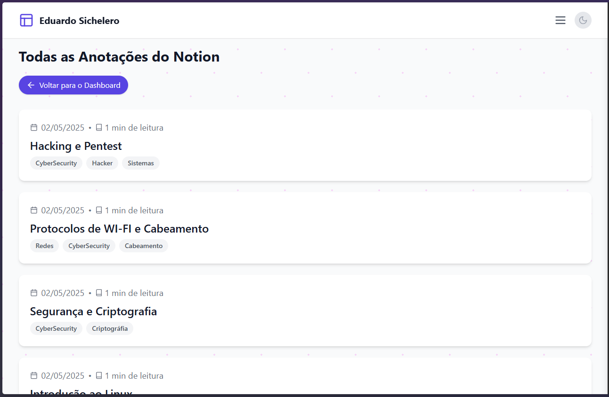

# Portfólio Web

Projeto de portfólio pessoal desenvolvido com **React + Vite**, exibindo dados dinâmicos via integração com a API do Notion. Nele são mostradas anotações, objetivos, certificados e demais informações do autor.

---

## 📸 Screenshots




---

## 🌐 Link do Projeto Online

O projeto está disponível em produção no seguinte link:

🔗 [eduardosichelero.site](https://eduardosichelero.github.io/portifolio-web/)

---

## 🚀 Tecnologias Utilizadas

* [React](https://reactjs.org/)
* [Vite](https://vitejs.dev/)
* [TypeScript](https://www.typescriptlang.org/)
* [TailwindCSS](https://tailwindcss.com/)
* [React Router DOM](https://reactrouter.com/)
* [Lucide React](https://lucide.dev/)
* [ScrollReveal](https://scrollrevealjs.org/)
* API externa: [portifolio-api](https://portifolio-api-mu.vercel.app/)

---

## ⚙️ Pré-requisitos

Antes de rodar o projeto, você precisa ter instalado:

* [Node.js](https://nodejs.org/) (v18 ou superior)
* npm

---

## 🛠️ Como rodar localmente

```bash
# Clone o repositório
git clone https://github.com/eduardosichelero/portifolio-web.git

# Acesse a pasta do projeto
cd portifolio-web

# Instale as dependências
npm install

# Copie o arquivo de variáveis de ambiente
cp .env.example .env
```

Ou crie manualmente o arquivo `.env` na raiz do projeto:

```
VITE_API_URL=https://portifolio-api-mu.vercel.app
```

Em seguida, inicie o projeto:

```bash
npm run dev
```

> ⚠️ **Atenção:**
> Se o projeto estiver com o base configurado como `/portifolio-web/` (padrão para deploy em subpasta/GitHub Pages), acesse localmente em:
> [http://localhost:5173/portifolio-web/](http://localhost:5173/portifolio-web/)
>
> Se quiser rodar na raiz (`/`), altere o `base` em `vite.config.ts` para `'/'` e o `basename` do `BrowserRouter` para `'/'` em `main.tsx`.

---

## 🏗️ Gerar build para produção

```bash
npm run build
```

Os arquivos finais ficarão na pasta `dist/`.

---


## 📦 Deploy na Vercel

Este projeto está hospedado na Vercel. Para publicar:

```bash
vercel --prod
```

Os arquivos finais ficam na pasta `dist/`.

## 📜 Scripts disponíveis

- `npm run dev` — inicia ambiente de desenvolvimento
- `npm run build` — gera build de produção
- `npm run preview` — visualiza build local
- `npm run lint` — verifica padrões de código

## 🔑 Variáveis de ambiente

Veja o arquivo `.env.example` para configuração das variáveis necessárias.

## 🔗 Integração com API

O frontend consome dados da API hospedada em:

[https://portifolio-api-mu.vercel.app/api/notion/notes](https://portifolio-api-mu.vercel.app/api/notion/notes)

Defina no `.env`:

```
VITE_API_URL=https://portifolio-api-mu.vercel.app
```

---

## 🚾 Problemas conhecidos

* **404 após deploy no GitHub Pages:**
  Certifique-se de que o `base` no `vite.config.ts` e o `homepage` no `package.json` estão corretos.
* **Acesso local:**
  Se acessar localmente, use a URL com `/portifolio-web/` ou ajuste o `base` para `/`.
* **Notas com título "Sem título":**
  Isso ocorre quando o campo de título não está definido no Notion ou o nome do campo foi alterado.

---

## 🤝 Contribuindo

Contribuições são sempre bem-vindas!

* Faça um fork do projeto
* Crie sua branch: `git checkout -b minha-feature`
* Envie um pull request ❤️

---

## 📄 Licença

Este projeto está sob a licença MIT.